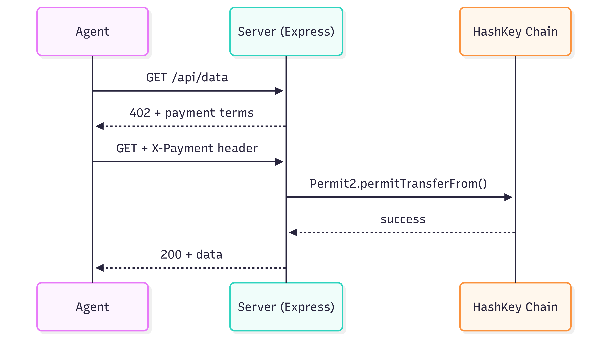

# AgentBill HSK

**x402 payment middleware for [HashKey Chain](https://hsk.xyz)** — gate any Express endpoint behind a USDC micropayment, collected automatically by AI agents via Permit2.

Built for the [HashKey Chain On-Chain Horizon Hackathon](https://dorahacks.io/hackathon/hsk-onchain-horizon) (PayFi track) as part of the [AgentBill](https://github.com/the-AgentBill) project.

## How it works

The [x402 protocol](https://x402.org) extends HTTP with a payment negotiation layer:

1. Agent calls a protected endpoint, server returns `402 Payment Required` with payment terms in a header
2. Agent signs a **Permit2 `SignatureTransfer`** authorization (no pre-approval needed per-payment)
3. Agent retries with the payment header, server submits the Permit2 transfer on-chain and returns `200 OK`

HashKey Chain's USDC uses **Permit2** as the settlement mechanism (no EIP-3009 `transferWithAuthorization` support). AgentBill HSK handles this transparently. The agent just calls `fetch()`.



## Supported network

**HashKey Chain Testnet** (chain ID 133)

- USDC: `0x18Ec8e93627c893ae61ae0491c1C98769FD4Dfa2`
- Permit2: `0x000000000022D473030F116dDEE9F6B43aC78BA3`
- x402ExactPermit2Proxy: `0x402085c248EeA27D92E8b30b2C58ed07f9E20001`

## Quick start

### 1. Install

```bash
npm install
cp .env.example .env
```

### 2. Run the server

```bash
npm run example:server
```

```
AgentBill HSK server running on http://localhost:3000
  GET /            → free
  GET /api/weather → $0.01 USDC (x402 + Permit2)
```

### 3. Run the agent

In a separate terminal:

```bash
npm run example:agent
```

```
Agent wallet: 0xabc...
Target:       http://localhost:3000/api/weather

Calling paid endpoint...
Status: 200 (9078ms)
Response: {
  "city": "Hong Kong",
  "temp": "28°C",
  "humidity": "78%",
  "condition": "Partly cloudy"
}

Payment settled on HashKey Chain via Permit2.
```

## API

### Server: `requirePayment(options)`

Express middleware that gates a route behind a USDC payment.

```typescript
import { agentBill, requirePayment } from "agentbill-hsk";

agentBill.init({
  receivingAddress: "0xYourAddress",
  network: "hashkey-testnet",
});

app.get("/api/data", requirePayment({ amount: "0.01" }), (req, res) => {
  res.json({ data: "..." });
});
```

**Options:**

| Option        | Type     | Description                                |
| ------------- | -------- | ------------------------------------------ |
| `amount`      | `string` | Payment amount in USDC, e.g. `"0.01"`      |
| `currency`    | `"USDC"` | Currency (only USDC supported)             |
| `description` | `string` | Human-readable description shown to agents |

**`agentBill.init(config)`:**

| Option                  | Type          | Description                                 |
| ----------------------- | ------------- | ------------------------------------------- |
| `receivingAddress`      | `0x${string}` | Wallet that receives USDC                   |
| `network`               | `NetworkName` | `"hashkey-testnet"`                         |
| `facilitatorPrivateKey` | `0x${string}` | Overrides `FACILITATOR_PRIVATE_KEY` env var |

### Agent: `createPayingClient(config)`

Creates a payment-enabled `fetch` client that handles the full x402 flow automatically.

```typescript
import { createPayingClient } from "agentbill-hsk";

const client = createPayingClient({
  privateKey: process.env.AGENT_PRIVATE_KEY,
  network: "hashkey-testnet",
});

// Just call fetch. 402 handling, Permit2 signing, and retry are automatic.
const response = await client.fetch("http://localhost:3000/api/data");
const data = await response.json();
```

**Config:**

| Option               | Type          | Default  | Description                                     |
| -------------------- | ------------- | -------- | ----------------------------------------------- |
| `privateKey`         | `0x${string}` | required | Agent's wallet private key                      |
| `network`            | `NetworkName` | required | `"hashkey-testnet"`                             |
| `autoApprovePermit2` | `boolean`     | `true`   | Auto-approve Permit2 to spend USDC on first use |

**Returns** a `PayingClient`:

| Property           | Type                          | Description                                    |
| ------------------ | ----------------------------- | ---------------------------------------------- |
| `fetch`            | `typeof globalThis.fetch`     | Drop-in replacement, handles 402 automatically |
| `address`          | `0x${string}`                 | Agent's wallet address                         |
| `approvePermit2()` | `() => Promise<hash \| null>` | Manually trigger the one-time Permit2 approval |

## Deploying the proxy

The `x402ExactPermit2Proxy` is already deployed on HashKey testnet. To deploy on another EVM chain:

```bash
npm run deploy:proxy
```

This uses Arachnid's deterministic CREATE2 deployer to land the proxy at the canonical address `0x402085c248EeA27D92E8b30b2C58ed07f9E20001`.

## Related

- [AgentBill SDK](https://github.com/the-AgentBill/SDK)
- [agentbill-base](../agentbill-base/) — Base/Coinbase variant (EIP-3009)
- [x402 protocol](https://x402.org)
- [x402 GitHub](https://github.com/coinbase/x402)
# agentbill-hsk
